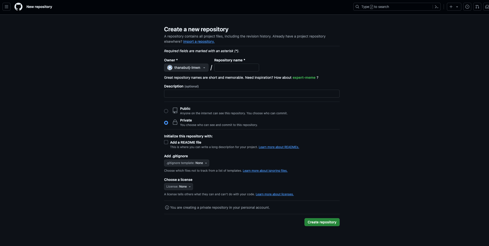
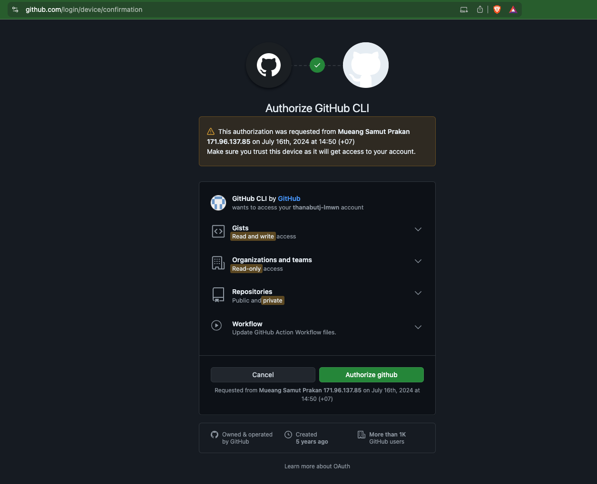
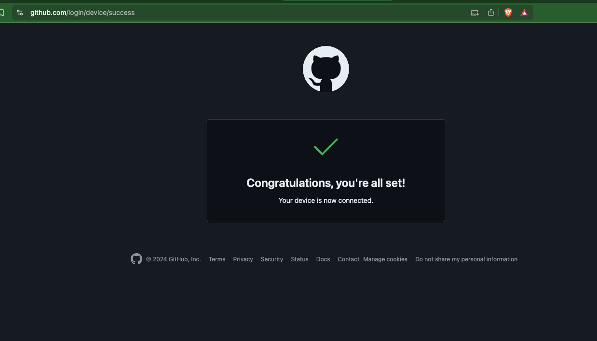

# Git part 1

- version control
- share code with teammates

## What is Git

Git is a Version control/Source control

https://git-scm.com/book/en/v2/Getting-Started-What-is-Git%3F

### important keywords
- repository
- change
- commit
- local
- remote
- HEAD

## Get started
make sure to install git [download](https://git-scm.com/downloads)

```bash
git version
# git version x.x.x
```

let's create new git project

```
mkdir -p workshop/git-basic
cd workshop/git-basic

git init

# hint: Using 'master' as the name for the initial branch. This default branch name
# hint: is subject to change. To configure the initial branch name to use in all
# hint: of your new repositories, which will suppress this warning, call:
# hint:
# hint:   git config --global init.defaultBranch <name>
# hint:
# hint: Names commonly chosen instead of 'master' are 'main', 'trunk' and
# hint: 'development'. The just-created branch can be renamed via this command:
# hint:
# hint:   git branch -m <name>
# Initialized empty Git repository in /your/directory/.git
```

hidden `.git` folder created
```
ls -a
#  .   ..   .git
```

## Make the working directory an git repository

First thing first, run this command to make our directory/folder an git repository

```
git init
```

## Basic commands

- status
- add
- push
- pull

### The most frequent used combo

```
git add .
git commit -m "this is commit message"
git push
```


### `status` command

```bash
git status
```

snippet from `git help status`
> Description
> Displays paths that have differences between the index file and the current HEAD commit, paths that have differences between the working tree and the index file, and paths in the working tree that are not tracked by Git (and are not ignored by gitignore(5)). The first are what you would commit by running git commit; the second and third are what you could commit by running git add before running git commit.

Try running it yourself

```
git status
# On branch master
# 
# No commits yet
#
# nothing to commit (create/copy files and use "git add" to track)
```

### `add` command

```bash
git add XXXXX
```

snippet from `git help add`
> Description
> This command updates the index using the current content found in the working tree, to prepare the content staged for the next commit. 
> It typically adds the current content of existing paths as a whole, but with some options it can also be used to add content with only part of the changes made to the working tree files applied, or remove paths that do not exist in the working tree anymore.

### `commit` command

```bash
git commit -m 'commit message'
```

> Description
> Create a new commit containing the current contents of the index and the given log message describing the changes. 
> The new commit is a direct child of HEAD, usually the tip of the current branch, and the branch is updated to point to it 
> (unless no branch is associated with the working tree, in which case HEAD is "detached" as described in git- checkout(1)).

```bash
git commit -m "this is the first commit"

git log --graph
```
you should see a new commit on the graph

### GIT GUI

- source tree [download](https://www.sourcetreeapp.com/)

- see graph on the GUI

### `push` command

> Description
> Updates remote refs using local refs, while sending objects necessary to complete the given refs.

before push we need a git repo

#### Create a git repository
Log in to your github account than click on the new button on the top left side of the page


Then you will see this form. We will keep it simple this time.
Name this repo `workshop-git-basic`
Select Private repository.
After that, click `Create repository`


Then a new repository will be created like this.


See the `…or push an existing repository from the command line` section at the button for command to add remote origin to your project directory

After all that, you should be able to push you code change to the github.
Now your code will be safe and secured at the remote repository.

#### Github cli

In order to push or commit change to your repository, the simplest way is using [Github cli](https://cli.github.com/).

follow this [Installation guide](https://github.com/cli/cli#installation) from their website.

after you install github cli on your system.

enter this command on your terminal

```bash
gh auth login
```

It will ask you some questions, answer like this.

```bash
 What account do you want to log into?  [Use arrows to move, type to filter]
> GitHub.com
  GitHub Enterprise Server
```
select GitHub.com


```bash
 What is your preferred protocol for Git operations on this host?  [Use arrows to move, type to filter]
> HTTPS
  SSH
```
select HTTPS

```bash
Authenticate Git with your GitHub credentials? (Y/n)
```
press Enter or input Y

```bash
? How would you like to authenticate GitHub CLI?  [Use arrows to move, type to filter]
> Login with a web browser
  Paste an authentication token
```
select `Login with a web browser`

```bash
! First copy your one-time code: XXXX-XXXX
Press Enter to open github.com in your browser...
```

copy the code as you are instructed
then press enter, this page will 


enter one-time code from your terminal




## Next
[Part 2](https://github.com/thanabutj-lmwn/workshop-2024/blob/main/workshops/part-2.md)
