# CICD introduction with github action

What is CICD

> "CI/CD, which stands for continuous integration and continuous delivery/deployment, aims to streamline and accelerate the software development lifecycle."
> [red hat](https://www.redhat.com/en/topics/devops/what-is-ci-cd)

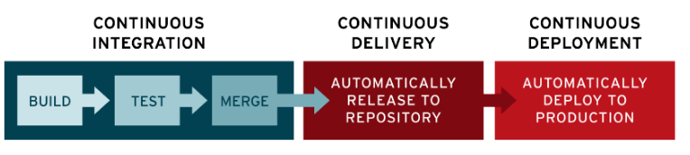

## Why

- to make sure that our changes are tested
- less effort
  - no repeated tasks
  - no human errors

## Github actions

### overview

https://github.com/features/actions

### Why github and github action

- github is widely use by many organizations especially open-sources.
- there is a free tier for us to use see the current plan below

Plan | Storage | Minutes (per month)
-- | -- | --
GitHub Free	| 500 MB | 2,000
GitHub Pro | 1 GB |	3,000
GitHub Free for organizations |	500 MB | 2,000
GitHub Team| 2 GB | 3,000
GitHub Enterprise Cloud	| 50 GB | 50,000

> When you are working in a company, they usually have an seft-hosted git
> 
> for Line Man, we use Gitlab.

## Get started

We will start from create an small golang project

> Why golang
> 
> because it has all of the toolchains built into the language

[download golang](https://go.dev/dl/)

```bash
go version
# go version go1.xx.x darwin/arm64
```

```bash
# In terminal
mkdir workshop-cicd
cd workshop-cicd
go mod init github.com/YOUR_GITHUB_USERNAME/workshop-cicd
```

Now open this folder with your IDE. You should see 1 file in this folder name `go.mod`
```bash
# In terminal
ls
# go.mod
```

Next create an new file name `main.go` and paste this code in the file.
```go
package main

import "fmt"

func main() {
	fmt.Println("Hello world !!!")
}
```

This is just a basic hello world application. Now we can run it.

Enter this command in your terminal.
```bash
# In terminal
go run main.go
# Hello world !!!
```

### Push our code to github

```bash
git init
```

Now `add`, `commit` and `push` our code to the git 
```bash
# In terminal
git add .
git commit -m "init project"
git push
```

But when run `git push`, we will get this error
```
# fatal: No configured push destination.
# Either specify the URL from the command-line or configure a remote repository using
#
#    git remote add <name> <url>
#
#and then push using the remote name
#
#    git push <name>
```

#### Create a git repository
Log in to your github account than click on the new button on the top left side of the page
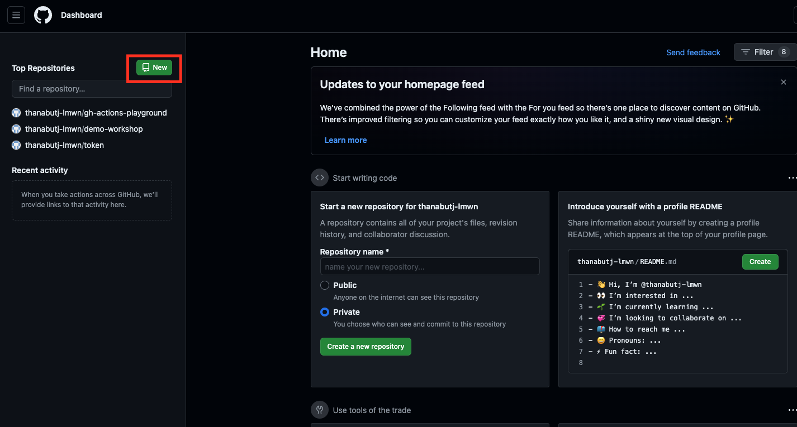

Then you will see this form. We will keep it simple this time.
Name this repo `workshop-cicd`
Select Private repository.
After that, click `Create repository`
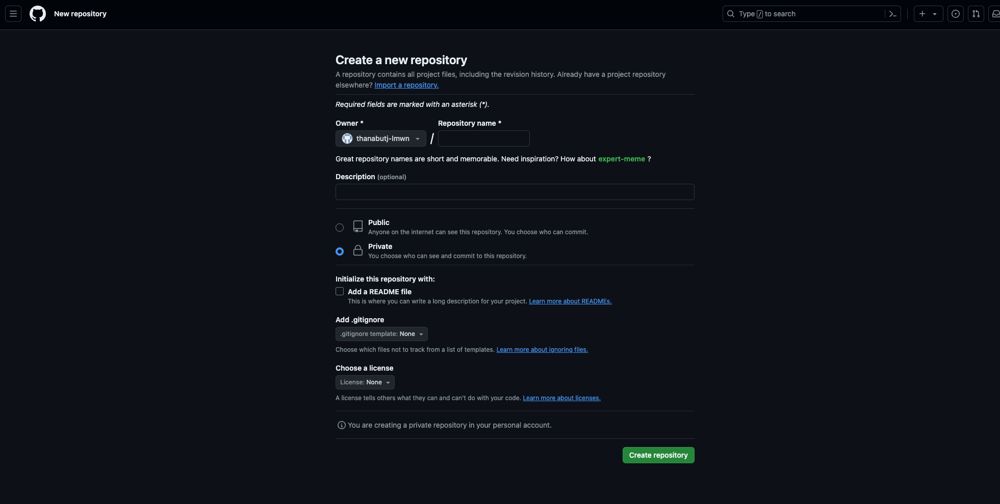

Then a new repository will be created like this.
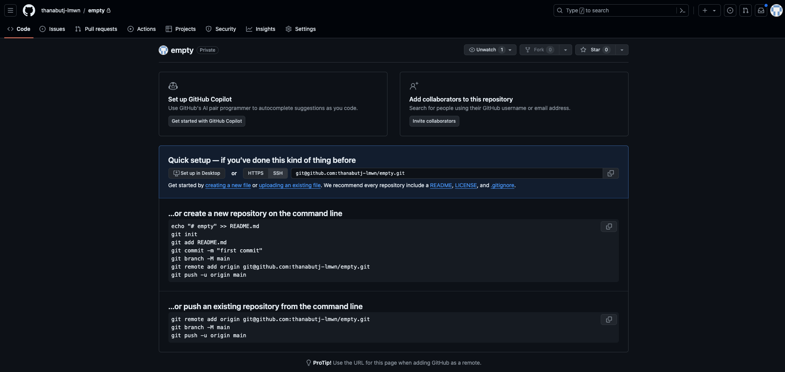

See the `…or push an existing repository from the command line` section at the button for command to add remote origin to your project directory

After all that, you should be able to push you code change to the github.
Now your code will be safe and secured at the remote repository.

### Add more feature to our project

As you can see, our project didn't do anything

Let's implement a simple addition feature

create a new file in the path like this `internal/calculator/add.go`
```go
//internal/calculator/add.go
package calculator

func Add(a, b int) int {
	return a + b
}
```

Then update our `main.go` like this
```go
package main

import (
	"fmt"

	"github.com/YOUR_GITHUB_USERNAME/workshop-cicd/internal/calculator"
)

func main() {
	sum := calculator.Add(1, 2)
	fmt.Println("Hello world !!!", sum)
}
```

Now when you run our program, it will output this.
```bash
# in terminal
go run main.go
# Hello world !!! 3
```

To make sure that our code will run correctly, let's add our first unittest to the project

We will use [testify](https://github.com/stretchr/testify) as an assertion libaray.
To install testify on our project, run this in the terminal
```bash
go get github.com/stretchr/testify
```

create a new file `internal/calculator/add_test.go`
```go
package calculator_test

import (
	"testing"

	. "github.com/YOUR_GITHUB_USERNAME/workshop-cicd/internal/calculator"
	"github.com/stretchr/testify/assert"
)

func TestAdd(t *testing.T) {
	actual := Add(1, 2)
	assert.Equal(t, 3, actual)
}
```

You can run tests by this command
This is test result when our test passed
```bash
go test ./...
# ?       github.com/YOUR_GITHUB_USERNAME/workshop-cicd [no test files]
# ok      github.com/YOUR_GITHUB_USERNAME/workshop-cicd/internal/calculator     0.333s
```

Let's make our test fail then run it again


```go
// github.com/YOUR_GITHUB_USERNAME/workshop-cicd/internal/calculator/add_test.go
func TestAdd(t *testing.T) {
	actual := Add(1, 2)
	assert.Equal(t, 100, actual)
}
```
This is test result when our test failed
```bash
go test ./...
# ?       github.com/YOUR_GITHUB_USERNAME/workshop-cicd [no test files]
# --- FAIL: TestAdd (0.00s)
#    add_test.go:12: 
#                Error Trace:    /path_to_your_folder/workshop-cicd/internal/calculator/add_test.go:12
#                Error:          Not equal: 
#                                expected: 100
#                                actual  : 3
#                Test:           TestAdd
#FAIL
#FAIL    github.com/YOUR_GITHUB_USERNAME/workshop-cicd/internal/calculator     0.32s
#FAIL
```

Now we have code that have failed test. Before we push this code to the github.
Let's create a workflow to test our code when a commit was push to the remote repository.

### Add github action to automatically run unittest against commits

Click on the `Actions` tab, then search for go in the search box.

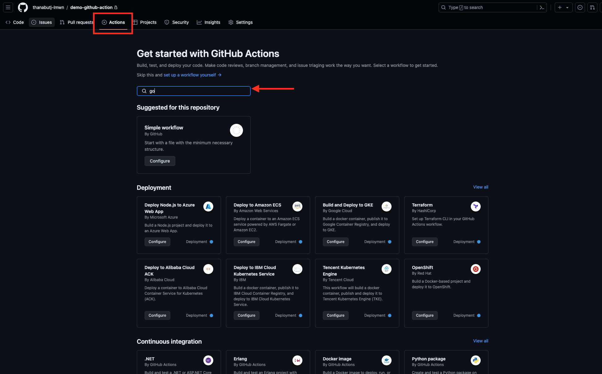

You will see this search result, click on the `Go By Github Actions`'s `Configure` button

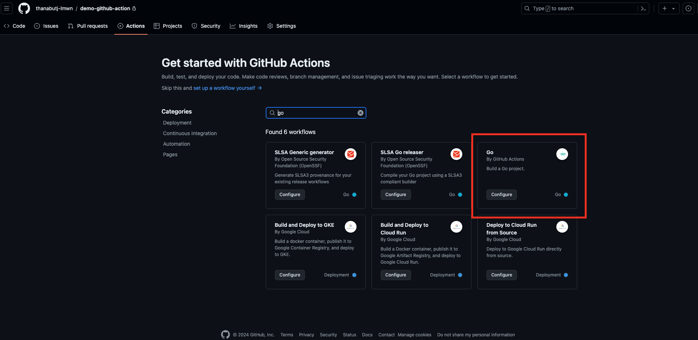

There will be `yml` github action generated for us.
We can use this exact templete for our purpose for now.

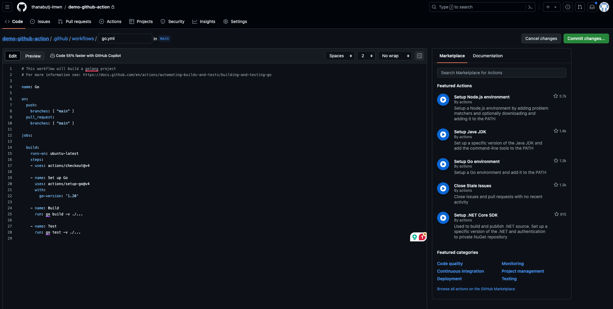

Click on the green `Commit changes...` button
Then this file will be commited in your repository.

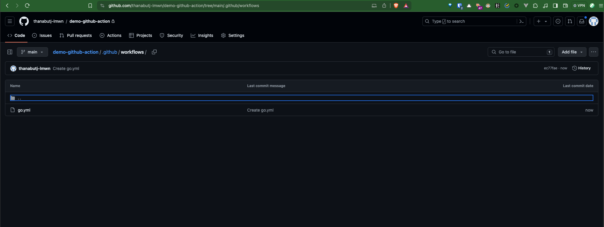

Now when we try pushing our changes with failed test case.

Click on the `Actions` tab again, you will see a workflow was created with the same name as the commit you just push.
In my case it `push with failed test`

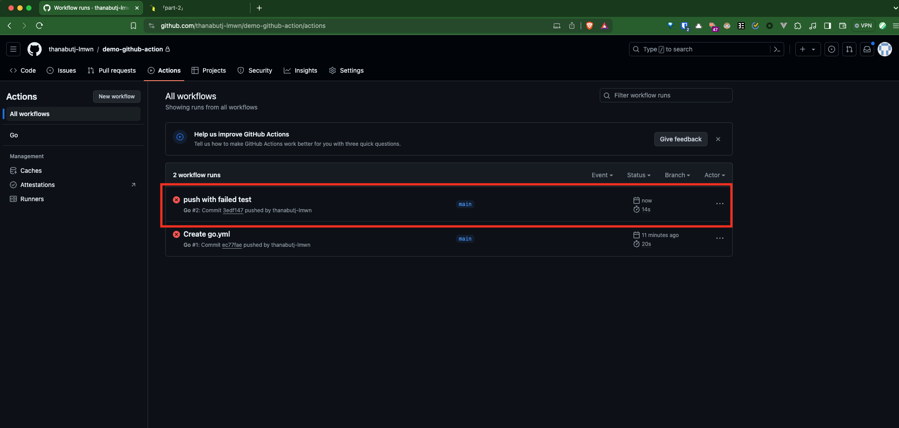

Click on the workflow, you will land on this page.
Then scroll down to the `Test` section, you will see the same test result that shown in your terminal.

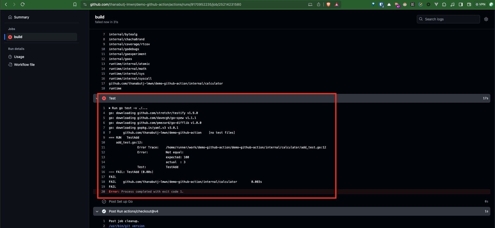

Now we have setup the github action to catch unittest errors on every commit automatically.


### Create Pull Request

Next Let's fix the failed test, but we will not working on the main branch directly.
We will create Pull Request to let our team review our code.

It might see as an roundabout way to work but as we value software correctness. Having more people review code is much better way to ensure that.

#### Create branch
> ref: [Git Branching - Basic Branching and Merging](https://git-scm.com/book/en/v2/Git-Branching-Basic-Branching-and-Merging)

First start by create a new branch name `fix-unittest`
> We will purposefully skip branch naming convention as it will be mainly difference from team to team.
```bash
git checkout -b fix-unittest
```

Run this commnd then you will be switch to new bracnh name `fix-unittest`
Let's see `git reflog` result

```bash
git reflog
```

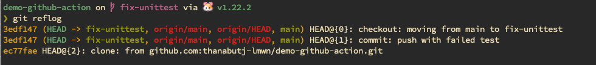

Focus on the `HEAD -> fix-unittest`, this indicate that you are at the branch `fix-unittest`

Now let's edit the fail test case at `internal/calculator/add_test.go`

```go
func TestAdd(t *testing.T) {
	actual := Add(1, 2)
	assert.Equal(t, 3, actual)
}
```

Run test again, it should be success now.

```bash
go test ./...
# ?       github.com/YOUR_GITHUB_USERNAME/workshop-cicd [no test files]
# ok      github.com/YOUR_GITHUB_USERNAME/workshop-cicd/internal/calculator     0.333s
```

```bash
git add .
git commit -m "fix unittest"
git push -u origin fix-unittest
```

On the homepage of our github repository, we will see the `fix-unittest` branch here.
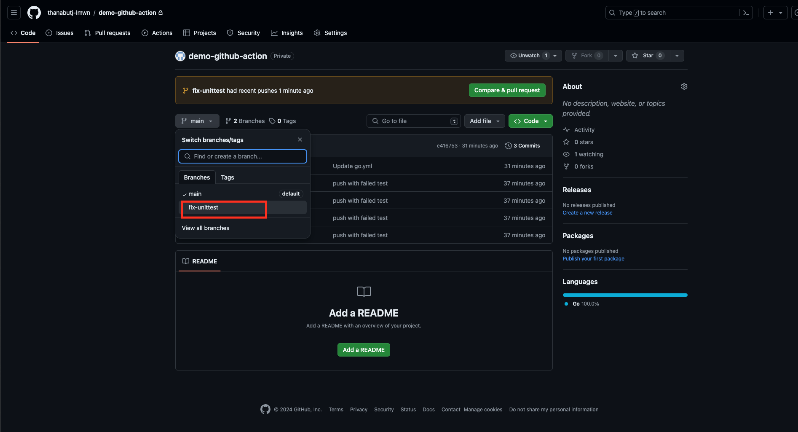

#### Compare change and Create PR

Click on the `Pull requests` tab. You will see that the github automatically detect that new branch was created.
We can conveniently click on `Compare & pull request` button. This will automatically select target branch and source branch for us.

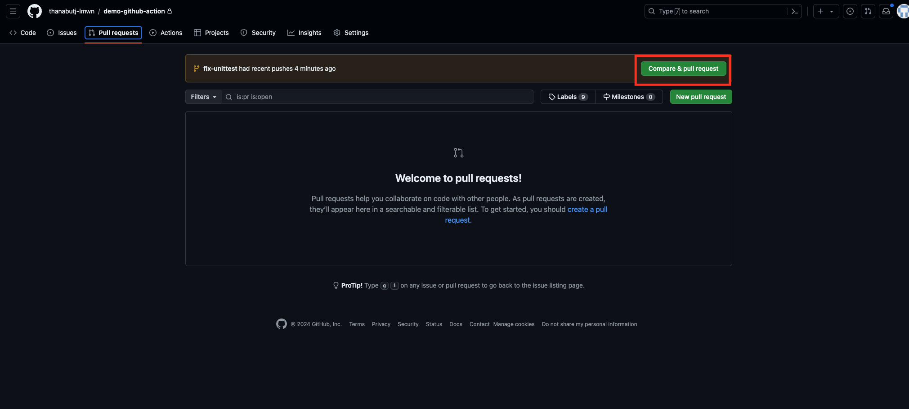

- Recheck that target branch and source branch is correct 
  - Target branch is branch that new code will be merged into
  - Srouce branch is branch that your work is in it
- Add change detail to give context to the reviewer
- Review your change again that everything is correct

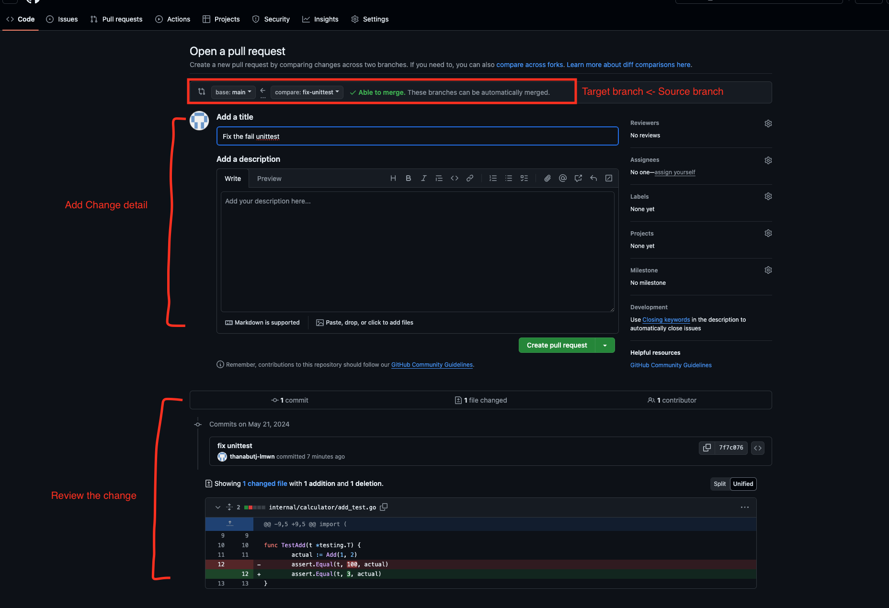

When click on `Create pull request` button. You will be redirected to this page.
A workflow github action is created to run test for us (as we setup it before).

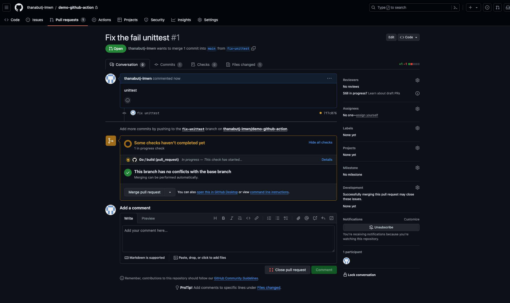

When workflow finished, the result will be shown on the PR page.
In this case, it show success result as we just fixed the unittest.

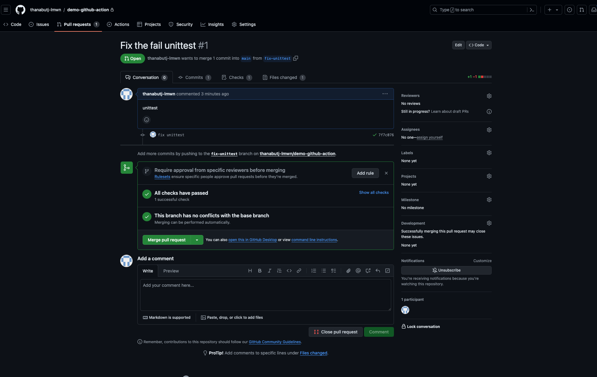

We can now copy and send this PR url to our teammate to have it reviewd.
As an reviewer, you can click on `File changed` tab to see if the changes are correct.

<!-- TODO: Reviwer Approve -->

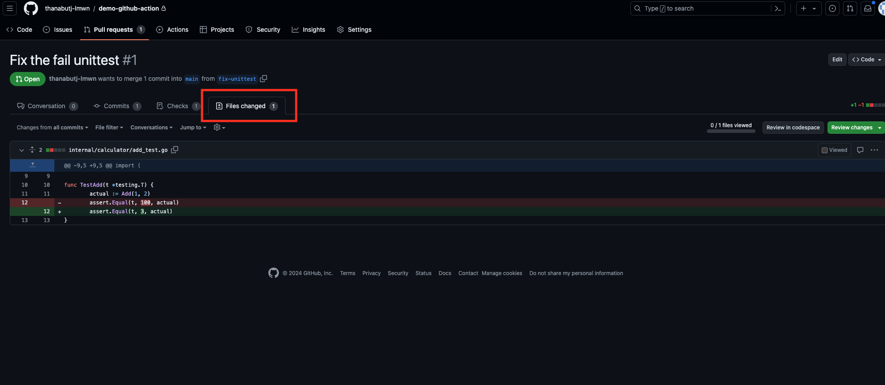

As right now we are working alone, let click on the `Merge pull request` button.

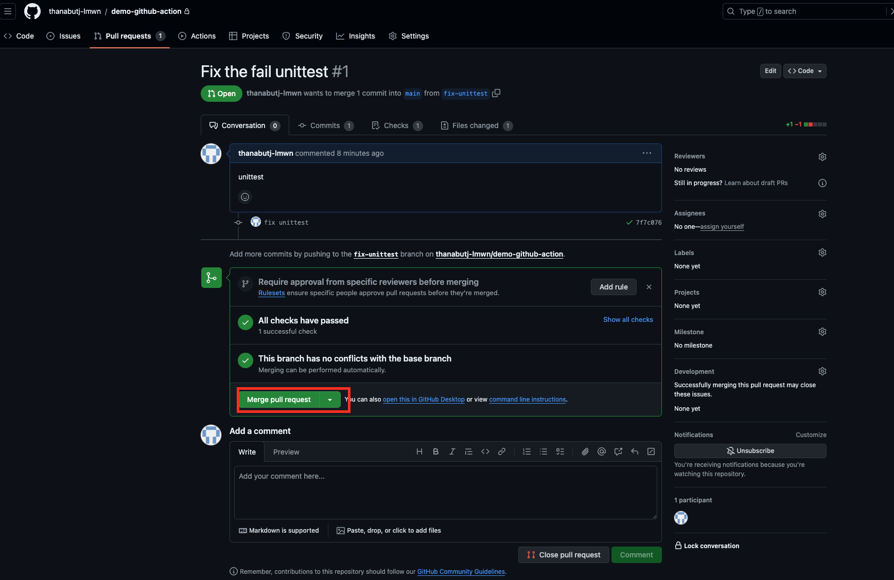

You will see the PR will be merged and closed

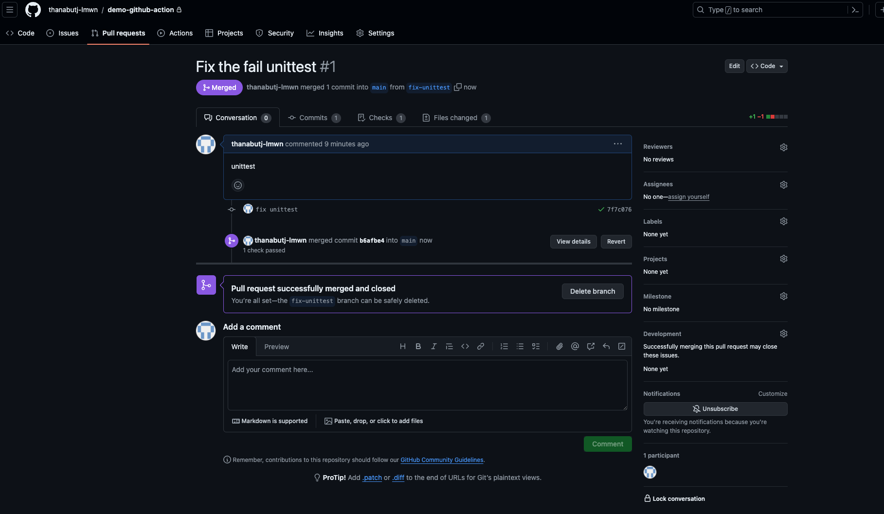

Go to the homepage, infomation about merged PR also show here.

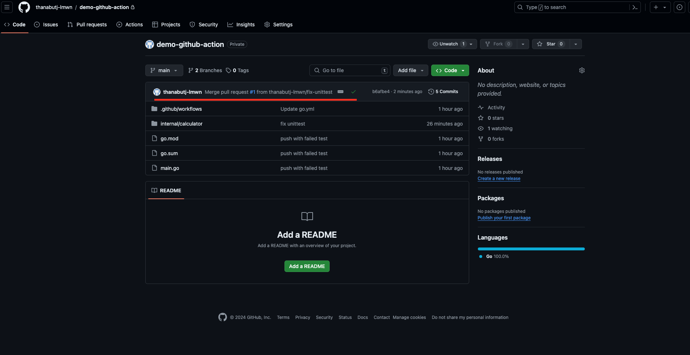

As new change commited to the main branch, new workflow also was created for us too.

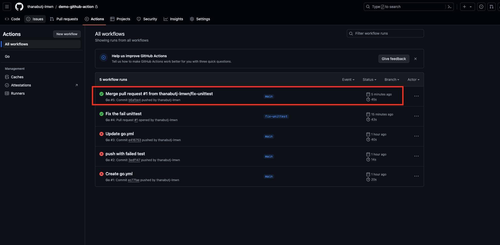

## Conclusion

<!-- TODO: add closing thought -->

## Next
[Part 3](https://github.com/thanabutj-lmwn/workshop-2024/blob/main/workshops/part-3.md)
