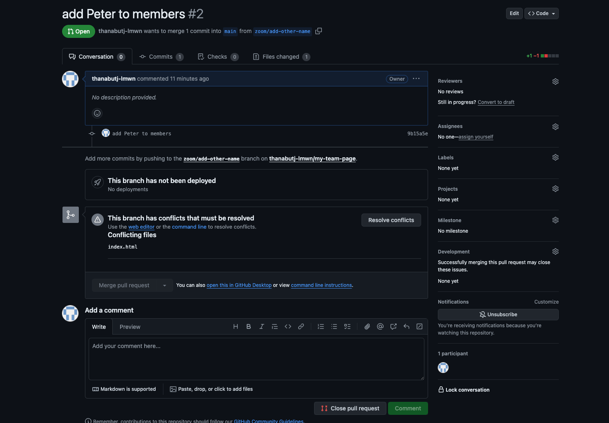

# Create a website and automatically deploy with github page

We will collaborate with the team in this part

- Form a 2-3 persons team
- pick 1 person to be an repository owner
- We will build a team website for this part

## Create a new github repository


- repo name: my-team-page
- select: Public repository type
- click create

### Configure repository github page
- On repository home page, click on `Setting` tab
- On the sidebar, under `Code and automation` section click on the `Pages` button.
- On Build and deployment > Source
  - change from `Deploy from a branch` > `Github Actions`
  - select `Static HTML` by Github Actions by click `Configure` button
  - 
- You will be redirect to this page. Just click on `Commit changes...` on the top-right without modify anything
  - 

### Create our website page

Let's commit this file to our repository

create file name `index.html` then 

```html
<!DOCTYPE html>
<html>
   <head>
      <title>My team page</title>
   </head>
   <body>
      <h1>Hello world</h1>
   </body>
</html>
```

after commit this file to your repository should look like this


Check our github action if it successfully ran


Now we can visit our page by get the link from here

Setting > (Code and automation) Pages > You can visit your site here


Our page should look like this


## Invite team members


## Let's Collab 1

First, team leader update `index.html` to this code below

```html
<!DOCTYPE html>
<html>
   <head>
      <title>My team page</title>
   </head>
   <body>
      <h1>Members</h1>
      <ul>
        <li>PLACE_YOUR_NAME_HERE</li>
      </ul>
   </body>
</html>
```

`add` `commit` `push` this to the remote repository

### add each member name by create Pull request

- make sure to clone the project to your computer
- create new branch `{YOUR_NAME}/add-my-name`
  - replace `{YOUR_NAME}` with your nickname so we can indentify whose branch it is at a glance
- in `index.html` replace `PLACE_YOUR_NAME_HERE` with your name
  - make sure to edit it inplace without create a new `<li>` tag
- push your branch to the remote
- create PR 

send your PR link to your friends, so they can review your change.

You can approve change by


#### Merge first PR
- select one of your team members PR
- merge that selected PR
- after PR merged, github will say `This branch has conflicts that must be resolved` on the other PRs
  - we can not merge PR until we `Resolve conflicts`
  - 

> What is merge conflicts
> A "merge conflict" happens when two or more changes to a codebase or document can't be automatically combined.

We have a few ways to resolve git conflicts

#### Using Github website
click `Resolve conflicts` button on this page


You will be redirect to this page below


change the code as you like then click `Mark as resolved` button on the top right


then click `commit merge`


now you PR should be able to marge now as we resolve all the conflicts


#### Resolve conflict on your local machine

Switch to the main branch. When you pull it to latest version, you should see that the li tag has your friend name on it.
```bash
git checkout main
git pull
cat index.html
<!DOCTYPE html>
<html>
   <head>
      <title>My team page</title>
   </head>
   <body>
      <h1>Members</h1>
      <ul>
        <li>Your friend name</li>
      </ul>
   </body>
</html>
```

We will try to merge our change to the main branch but before that let's run help on the merge command first
```bash
git merge --help
```

You will see Git manaul popped up on your terminal. Let's look at the Description section together

Now run this command to merge your branch to the main branch (make sure that you are at the main branch)

```bash
git checkout main
git merge your-branch
Auto-merging index.html
CONFLICT (content): Merge conflict in index.html
Automatic merge failed; fix conflicts and then commit the result.
```

You will see that merge failed and we have to resolve conflicts before we can continue.
Let's look inside `index.html` file.

```bash
cat index.html
<!DOCTYPE html>
<html>
   <head>
      <title>My team page</title>
   </head>
   <body>
      <h1>Members</h1>
      <ul>
<<<<<<< HEAD
        <li>Your friend name</li>
=======
        <li>Your name</li>
>>>>>>> your-branch      
      </ul>
   </body>
</html>
```

There are `<<<<<<<` `=======` and `>>>>>>>>` appeared in your code.


The part between `<<<<<<< HEAD` and `=========` is code on the main branch.
```html
<!-- This part is main branch code -->
<<<<<<< HEAD
        <li>Your friend name</li>
=======
```

The part between `========` and `>>>>>> your-branch`
```html
<!-- This part is your code on your-branch -->
=======
        <li>Your name</li>
>>>>>>> your-branch
```

This was automatically marked by git itself.
To resolve these conflicts, we just remove those lines that generated by git (`<<<<<<<` `=======` and `>>>>>>>>`)

```bash
cat index.html
<!DOCTYPE html>
<html>
   <head>
      <title>My team page</title>
   </head>
   <body>
      <h1>Members</h1>
      <ul>
        <li>Your friend name</li>
        <li>Your name</li>
      </ul>
   </body>
</html>
```

You can edit the code further, but in this case we don't need to change it anymore.
When you happy with the change, you can run `git add` and `git commit`

```bash
git add .

git commit
```

after you ran `git commit`, it will open git commit edit message on your default text editor like this.
```bash
Merge branch 'your-branch'

# Conflicts:
#	index.html
#
# It looks like you may be committing a merge.
# If this is not correct, please run
#	git update-ref -d MERGE_HEAD
# and try again.


# Please enter the commit message for your changes. Lines starting
# with '#' will be ignored, and an empty message aborts the commit.
#
# On branch main
# Your branch and 'origin/main' have diverged,
# and have 1 and 2 different commits each, respectively.
#
# All conflicts fixed but you are still merging.
#
# Changes to be committed:
#	modified:   index.html
#

```
you just can save and quit out of the text editor.

> for `vim` type `:wq` enter
>
> for `nano` press `ctrl+o` then `ctrl+x`

The command `git commit` will output this message as we successfully resolved git conflicts.
```bash
git commit
[main 995c5a2] Merge branch 'your-branch'
```

When you run `git log --graph`, you can see on the graph how your change diverge and merged into the main branch.
```bash
git log --graph
# this is shorten version
*   commit 995c5a2d3990876f178ea2f367586ea753a2ae72 (HEAD -> main)
|\  
| |     Merge branch 'your-branch'
| |
| * commit 6369a39fc684cb33ce1d24eea862b725764e0d0f (your-branch)
| |     change to your name
| |
* | commit 11b5c915950bb50011f11d7008a1dd2ef489c761
|/  
|       merged from your friend pr
*  ....
```

This method of resolve git conflicts can be done but for this case rebase is a better solution.

#### Resolve conflict by rebase your branch

When your-branch is behide the main branch because your-branch is `base` on the older version of the main branch.

Your can you `rebase` command to change `base` of your-branch to the latest version.

Let's look at `git rebase --help` manaul together


Let's say we have `main` branch and `your-branch` at the same stage as the start of previous section.
```bash
git checkout main
git pull
cat index.html
<!DOCTYPE html>
<html>
   <head>
      <title>My team page</title>
   </head>
   <body>
      <h1>Members</h1>
      <ul>
        <li>Your friend name</li>
      </ul>
   </body>
</html>

git checkout your-branch
cat index.html
<!DOCTYPE html>
<html>
   <head>
      <title>My team page</title>
   </head>
   <body>
      <h1>Members</h1>
      <ul>
        <li>your name</li>
      </ul>
   </body>
</html>
```

We rebase `your-branch` to the main branch by run `git rebase main`
```bash
git checkout your-branch
git rebase main
Auto-merging index.html
CONFLICT (content): Merge conflict in index.html
error: could not apply 6369a39... change to your name
hint: Resolve all conflicts manually, mark them as resolved with
hint: "git add/rm <conflicted_files>", then run "git rebase --continue".
hint: You can instead skip this commit: run "git rebase --skip".
hint: To abort and get back to the state before "git rebase", run "git rebase --abort".
hint: Disable this message with "git config advice.mergeConflict false"
Could not apply 6369a39... change to your name
```

git will tell us that rebase unsuccessfully because there's a conflict on `index.html`

```bash
cat index.html
<!DOCTYPE html>
<html>
   <head>
      <title>My team page</title>
   </head>
   <body>
      <h1>Members</h1>
      <ul>
<<<<<<< HEAD
        <li>Your friend name</li>
=======
        <li>Your name</li>
>>>>>>> 6369a39 (change to your name)
      </ul>
   </body>
</html>
```

Fix the `index.html` like we did in the previous section. then run
```bash
git add .
git rebase --continue
```

Git will open editor for us like the previous section. just save and quit from it.
```bash
change to your name

# Please enter the commit message for your changes. Lines starting
# with '#' will be ignored, and an empty message aborts the commit.
#
# interactive rebase in progress; onto 11b5c91
# Last command done (1 command done):
#    pick 6369a39 change to your name
# No commands remaining.
# You are currently rebasing branch 'your-branch' on '11b5c91'.
#
# Changes to be committed:
#	modified:   index.html
#
```
> for `vim` type `:wq` enter
>
> for `nano` press `ctrl+o` then `ctrl+x`

the `git rebase --continue` will print out this to your terminal.
```bash
git rebase --continue
[detached HEAD 9ee7611] change to your name
 1 file changed, 1 insertion(+)
Successfully rebased and updated refs/heads/your-branch.
```

Let's look at `git log --graph`
```bash
git log --graph
# shorten version
* commit 9ee76110b8c8af39f46e085f0cae09b913a4b335 (HEAD -> your-branch)
|     change to your name
|
* commit 11b5c915950bb50011f11d7008a1dd2ef489c761 (main)
|     merged from your friend pr
|
* commit aeab8299e60c3b7135f12adb41bf57a3ed81f4f9
|     update
|
* ....
|
```
This is look a lot cleaner than the merge version.

This is better when you intend to PR your branch. Then let the Github website merge your code instead.

#### Resolve conflict by cherry pick
Bonus section ??

### More on Resolve merge conflict
You can read more about merge conflicts on Github Document [here](https://docs.github.com/en/pull-requests/collaborating-with-pull-requests/addressing-merge-conflicts/about-merge-conflicts)
